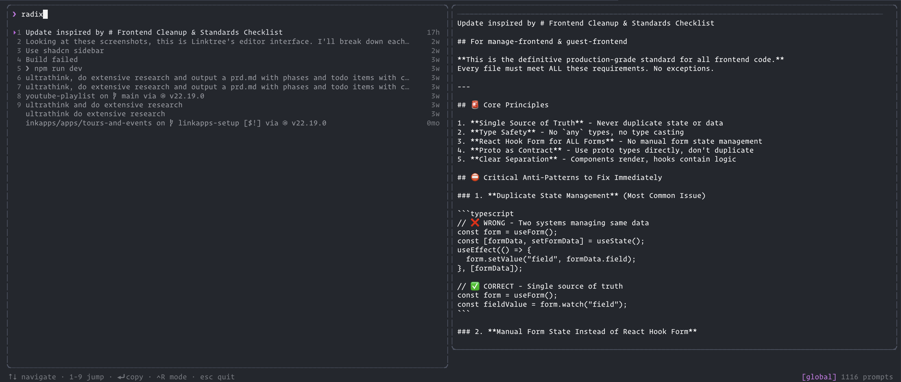

# ccs - Claude Code Search

[](https://www.npmjs.com/package/claude-code-search)
[](https://opensource.org/licenses/MIT)

Like [fzf](https://github.com/junegunn/fzf) or [atuin](https://github.com/atuinsh/atuin), but for your Claude Code prompts.



## Why?

Your best prompts are buried across dozens of Claude Code sessions. This tool lets you instantly search and reuse them instead of rewriting from scratch.

## Install

```bash
npm install -g claude-code-search
```

## Usage

```bash
ccs                     # Launch interactive TUI
ccs -l                  # List recent prompts
ccs -s "refactor"       # Search for "refactor"
ccs -l -j               # Output as JSON
ccs -l -n 50            # List last 50 prompts
ccs -p /path/to/proj    # Filter by project path
```

Select a prompt and it's copied to your clipboard, ready to paste.

### Pipe to Claude

Extract insights from your prompt history:

```bash
ccs -l | claude "what patterns do you see in how I prompt?"
ccs -s "refactor" -j | claude "summarize these prompts"
```

## Features

- **Fuzzy search** - Find prompts by any words they contain
- **Relevance ranking** - Results sorted by match quality, not just date
- **Split-pane preview** - See full content before selecting
- **Quick jump** - Press 1-9 to instantly select
- **Filter modes** - Search globally or within current directory
- **Non-interactive mode** - Use with `-l` or `-s` for scripting
- **Color support** - Respects `NO_COLOR` and `FORCE_COLOR`

## CLI Options

```
Options:
  -l, --list            List all prompts (non-interactive)
  -s, --search <query>  Search prompts with query (non-interactive)
  -j, --json            Output as JSON (use with -l or -s)
  -n, --limit <n>       Limit number of results (default: 100)
  -p, --project <path>  Filter by project path
  --projects-dir <dir>  Projects directory (default: ~/.claude/projects)
  -v, --version         Show version number
  -h, --help            Show help
```

## Configuration

### Custom Projects Directory

By default, ccs reads from `~/.claude/projects/`. You can override this to use a different location (e.g., a synced backup):

**CLI flag** (highest precedence):
```bash
ccs --projects-dir ~/backup/claude/projects
```

**Environment variable**:
```bash
export CCS_PROJECT_DIR=~/backup/claude/projects
ccs
```

The CLI flag takes precedence over the environment variable.

## Keyboard Shortcuts

| Key | Action |
|-----|--------|
| `↑` / `↓` or `j` / `k` | Navigate results |
| `1-9` | Quick jump to result |
| `Enter` | Copy & exit |
| `Ctrl+R` / `Shift+Tab` | Toggle global/directory filter |
| `Esc` / `Ctrl+C` | Quit |

## Exit Codes

| Code | Meaning |
|------|---------|
| 0 | Success |
| 1 | General error |
| 2 | Invalid arguments |
| 3 | No results found |

## Requirements

- Node.js >= 18
- Claude Code session data (defaults to `~/.claude/projects/`, configurable via `--projects-dir` or `CCS_PROJECT_DIR`)

## License

MIT - Matthew Blode
