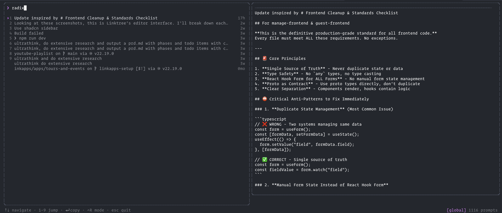

<div align="center">

# Claude Code Search

**Fuzzy-search prompts from Claude Code, Codex, and Cursor, then copy one back to your clipboard**

Like [fzf](https://github.com/junegunn/fzf) or [atuin](https://github.com/atuinsh/atuin), but for the prompts buried across your past sessions.

<p align="center">
  <a href="https://www.npmjs.com/package/claude-code-search">
    
  </a>
  <a href="https://github.com/mblode/claude-code-search/blob/main/LICENSE">
    
  </a>
</p>

</div>



## Install

```bash
npm install -g claude-code-search
```

Requires Node.js 24.11 or newer.

## Quickstart

```bash
ccs
```

`ccs` opens on the current directory so the first paint is not a full-history scan. Ctrl+R (or Shift+Tab) switches to every project. Type to filter. Results rank by match quality rather than date, the preview pane shows the full prompt, and `Enter` copies the selected prompt to your clipboard and prints it to stdout.

The same search runs non-interactively (stdout is data, stderr is logs):

```bash
ccs -s "refactor"
ccs -l -n 50
ccs -s "refactor" -j
ccs --source claude --source codex -s "test" --output json
ccs schema
```

## Options

| Flag | Default | Description |
| ---- | ------- | ----------- |
| `-l, --list` | | List prompts and exit, no TUI |
| `-s, --search <query>` | | Search for a query and exit, no TUI |
| `-j, --json` | | Alias for `--output json` |
| `--output <text\|json>` | `text` | Machine-readable JSON or text lines |
| `--no-input` | | Never prompt (agents / pipes) |
| `-n, --limit <n>` | `100` | Maximum number of results |
| `-p, --project <path>` | | Only prompts from one project path |
| `--source <source>` | `all` | `claude`, `codex`, `cursor`, or `all` (repeatable) |
| `--projects-dir <dir>` | `~/.claude/projects` | Claude projects directory |

## Keyboard shortcuts

| Key | Action |
| --- | ------ |
| `↑` / `↓` | Move through results |
| `1` to `9` | Jump straight to a result and copy it |
| `Enter` | Copy the selected prompt and exit |
| `Ctrl+R` / `Shift+Tab` | Toggle global or current-directory only |
| `Esc` / `Ctrl+C` | Quit |

## Sources

History is **read only**. Formats change between product versions; unknown records are skipped.

- **Claude Code:** `~/.claude/projects/` (and `~/.config/claude/projects` if present). Root `<uuid>.jsonl` transcripts; nested `subagents/` files are ignored so the same prompt is not indexed twice.
- **Codex CLI:** `~/.codex/sessions/**/rollout-*.jsonl` and `archived_sessions`. Compressed `.jsonl.zst` files are skipped. Directory-scoped loads use `rg` when it is on `PATH` to find matching session files instead of opening every rollout.
- **Cursor:** local `state.vscdb` (Composer headers + user bubbles). Cursor 3.x uses a global `composerHeaders` table. Mixed-source and TUI runs scope Cursor to the current workspace so the multi-gigabyte global DB is not fully loaded. `--source cursor` with no project filter reads all workspaces (slow).

## Agent skill

```bash
# from this repo
# copy skills/ccs/SKILL.md into your agent's skills directory
```

See [`skills/ccs/SKILL.md`](skills/ccs/SKILL.md).

## Library

```ts
import { loadMessages, search, run } from "claude-code-search";
```

## Exit codes

| Code | Meaning |
| ---- | ------- |
| `0` | Success |
| `1` | General error |
| `2` | Invalid arguments |
| `3` | No results found |

## Notes

- Colour follows `NO_COLOR` and `FORCE_COLOR`, and drops out when stdout is not a terminal.
- `CCS_PROJECT_DIR` overrides the Claude projects directory (`--projects-dir` wins).

## License

MIT

---

Crafted by [](https://blode.co) [Matthew Blode](https://blode.co)
